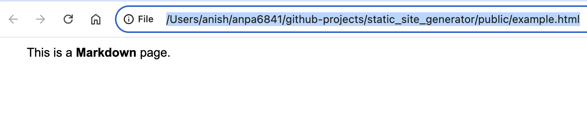
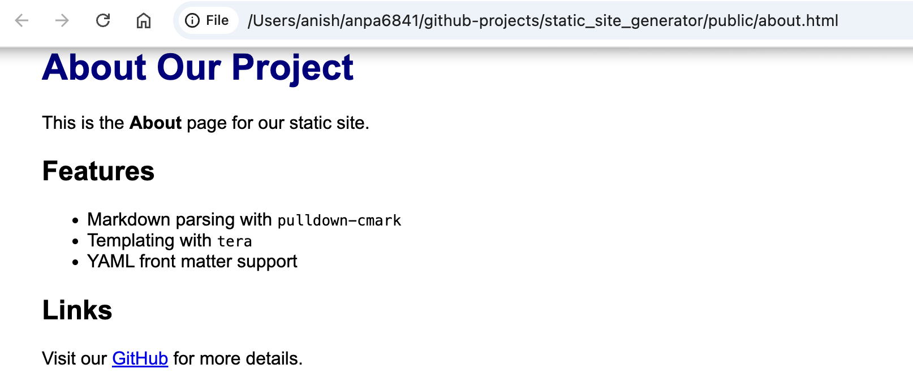

### Static Site Generator

### How To Run

- cargo build && cargo run
- ls public // list all generated html files
- cargo test

**Note**: Rust projects are vibecoded to the fullest extent with no knowledge whatsoever.

> This project was casually coded.
